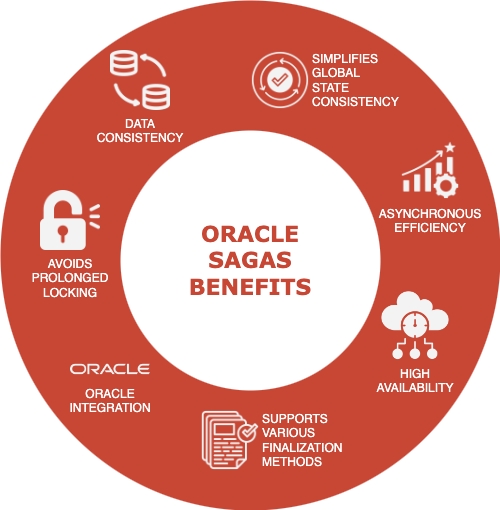

# Lab 1: Distributed Transactions and the Power of Sagas

## Introduction

Modern software systems are increasingly composed of distributed microservices that operate across multiple databases, modules, and services. Ensuring **data consistency** in such distributed systems is a significant challenge, especially when operations span multiple steps or services that can fail independently.

Traditional approaches such as **Two-Phase Commit (2PC)** are often heavyweight and difficult to scale, particularly for long-running transactions. Moreover, they can introduce performance bottlenecks due to locks and tight coordination across services. To address these issues, the **Saga Pattern** has emerged as a reliable alternative for managing **long-running, distributed transactions (LRA)**.

In this lab, we will explore the foundations of distributed transaction challenges, the Saga pattern, and how **Oracle Sagas** makes implementing this pattern seamless inside the Oracle Database. We’ll use the **CloudBank application** as our running example throughout the lab. This application models a simple yet realistic scenario: transferring money from one bank to another, such as from **Bank A to Bank B**, involving account debit, credit, validations, and failure handling.

* Estimated Time: XX minutes

### Objectives

By the end of this lab, you will be able to:

- Describe the challenges of distributed transactions in microservice-based systems.
- Explain the core concepts of the **Saga Pattern** and how it ensures eventual consistency.
- Explore how Oracle Sagas can simplify multi-step distributed workflows.

### Prerequisites
Before starting this lab, ensure you have:
- A Free-Tier or Livelabs Oracle Cloud account.
- Basic understanding of **PL/SQL** or **Java** programming.

## Task 1: Understanding Challenges of Distributed Transactions

---

Let us imagine the **CloudBank** application. A user initiates a transfer from **Bank A** to **Bank B**. Internally, the system must:

1. Validate that the source account has enough balance.
2. Debit the amount from Bank A's account.
3. Send a message or trigger to Bank B.
4. Credit the destination account in Bank B.
5. Log the transaction and notify the user.

If any of these steps fail—say, the network between Bank A and Bank B goes down, or the credit to Bank B fails—**data inconsistency** could arise. For example, the amount could be debited from Bank A, but not credited to Bank B.

Traditional 2PC would try to lock both databases until the entire operation completes. This can:

- **Block resources for a long time**.
- **Impact system availability**.
- **Not scale well with multiple concurrent transfers**.

**Real-World Pain Points**:

- **Network partitions** between services.
- **Partial failures** that are hard to rollback.
- **Inconsistent recovery logic** coded across different teams.
- **Retry storms**, where multiple retries lead to duplicate or invalid operations.

Hence, a better strategy is to model the transaction as a **Saga**, where each step is independent and can be compensated if needed.

---

## Task 2: Concepts of the Saga Pattern

---

The **Saga Pattern** is a sequence of **local transactions**, where each transaction updates data within a single service, and subsequent steps are triggered by messaging. The **Saga Pattern** is an architectural pattern that breaks a long-running transaction into a sequence of **smaller, independent sub-transactions**, each with a corresponding **compensating transaction**. If one of the steps fails, a series of **compensating transactions** are executed to undo the previous operations.

### Key Concepts:

- **Local Transactions:** Each step is a local transaction that commits independently.
- **Compensation:** Reverses effects of already-committed transactions on failure.
- **Forward Recovery:** Instead of rolling back, sagas aim to restore consistency by applying business-defined compensations.

### Characteristics of Saga:

- **Asynchronous coordination**
- **No global locks**
- **Eventually consistent**
- **Scalable and fault-tolerant**

---

## Task 3: Oracle Sagas to the Rescue

---

Oracle Sagas provide **native support for the Saga Pattern** in Oracle Database 23ai onwards. The feature enables developers to model, execute, monitor, and compensate multi-step workflows directly within the database engine using either **PL/SQL** or **Java**. Implementing the Saga pattern manually requires:

- Messaging infrastructure
- State management
- Compensation logic
- Consistent transaction flow orchestration

This can become error-prone and time-consuming.

Oracle Sagas allows developers to:

- Register participants, coordinators, and initiators using the `DBMS_SAGA_ADM` package.
- Define compensation logic in PL/SQL or Java
- Use declarative annotations in Java or the API's `DBMS_SAGA` PL/SQL package
- Monitor saga execution states
- Scale across PDBs or databases using TEQ and DB Links

### Key Features:

- **`DBMS_SAGA`** package for PL/SQL development.
- **Oracle Sagas Java Client** for Java-based orchestration using annotations.
- **Saga Broker, Coordinator, and Participants** as runtime components using the **`DBMS_SAGA_ADM`** package.
- **Automatic Compensation Execution** based on failure conditions.
- **Real-Time Monitoring** using dictionary views and logs.

### Benefits:

- Unified development using existing database tools
- Faster time to implementation
- Built-in reliability
- Auditing and traceability with system views and logs

Going back to our CloudBank scenario, developers only need to:

- Register the Initiator and Participants
- Define the saga workflows
- Add optional compensating procedures
- Use simple APIs or annotations to trigger the Saga

Manually building this infrastructure is not just slow—it’s painful, and often fragile. Oracle Sagas are tightly integrated with the Oracle database, enabling rollback-safe distributed transactions with minimal overhead.

---

## Task 4: Real-World Examples and Scenarios

---

Oracle Sagas can be applied to a variety of real-world distributed business processes. The following are some common scenarios:

### 1. **Banking and Financial Services**

- Funds transfer involving multiple institutions
- Loan approval workflows with intermediate checks

### 2. **E-commerce Order Processing**

- Inventory check → payment processing → shipment scheduling
- Refund processing with partial shipment

### 3. **Supply Chain Management**

- Multi-vendor procurement workflows
- Reversal of reserved stock across distributed warehouses

### 4. **Healthcare Scheduling**

- Schedule doctor → reserve lab → confirm pharmacy
- If lab slot unavailable, rollback appointment

### 5. **Insurance Claims**

- Multi-step claim approval with cross-departmental validation
- Claim rejection requiring compensations for already-processed steps

### Additional Use Cases:
- Telecom service provisioning
- IoT device onboarding
- Banking KYC and onboarding
- Travel planning
- and many more ...

In each case, Oracle Sagas gives you a flexible, native, and resilient way to model all of these without external tools or heavyweight locking mechanisms.
In real-world teams, workflows rarely go as planned. Oracle Sagas let you build systems that expect the unexpected—and recover gracefully.

---

## Task 5: Optional Quiz — Test Your Understanding

---

This short interactive quiz is designed to reinforce your understanding of Sagas, their benefits, and real-world use cases. You'll be presented with a couple of conceptual questions based on the material covered so far. Use this opportunity to validate your learning before moving to the environment setup in the next lab.

<canvas id="confetti-canvas" style="display: none; position: absolute; top: 0; left: 0; width: 100% !important; height: 100% !important; pointer-events: none; z-index: 0; background-color: transparent; max-width: none !important;"></canvas>
  

    <h3>Ready to Test?</h3>
    <button id="start-btn" style="background-color:#ae562c; color:#fff; padding:10px 20px; border:none; border-radius:5px; font-size:16px; cursor:pointer;">Start Quiz</button>
  

  

    

  <h4 id="question-number" style="margin-bottom: 0;"></h4>
  

  <ul id="options-list" style="list-style:none; padding:0;"></ul>

  <button id="submit-btn" class="submit-btn">Submit</button>

  <button id="prev-btn" class="nav-btn">← Previous</button>
  <button id="next-btn" class="nav-btn">Next →</button>

  

<h3 style="font-size: 28px; font-weight: bold;">🎉 Great Job! Let's move on to the next lab. 🎉</h3>

Now that you’ve seen how sagas can solve messy coordination problems—imagine having this power baked right into your database. Let’s get your environment ready.

You may now [proceed to the next lab](#next)

## Learn More

- For an overview of developing applications with Sagas, see the [Oracle Database 23ai Sagas Documentation](https://docs.oracle.com/en/database/oracle/oracle-database/23/adfns/developing-applications-saga.html).

- For technical details on PL/SQL support, refer to the [`DBMS_SAGA` Package Reference](https://docs.oracle.com/en/database/oracle/oracle-database/23/arpls/dbms_saga.html) and [`DBMS_SAGA_ADM`](https://docs.oracle.com/en/database/oracle/oracle-database/23/arpls/dbms_saga_adm.html).

- For integrating Sagas with Java, see the [Oracle Sagas Java Client Maven Repository](https://mvnrepository.com/artifact/com.oracle.database.saga/saga-core/23.7.0) and official API documentation.

## Acknowledgements

- **Contributors** - Amit Ketkar, Pavas Navaney, Vinay Pandhariwal,
Luis Cruz, Sebastian Gerritsen 
- **Created By/Date** - Vinay Pandhariwal, August 2025
- **Last Updated By/Date** - Vinay Pandhariwal, August 2025
