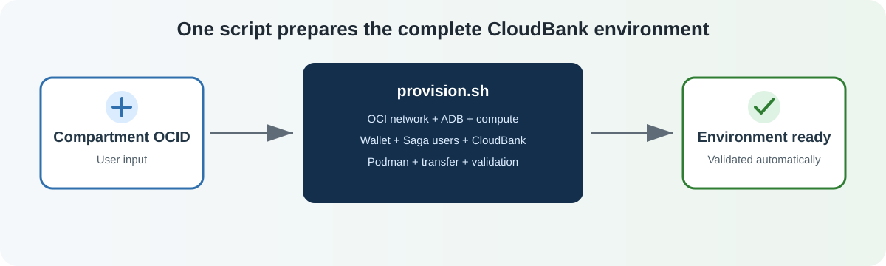

# Prepare your environment

## Introduction

This lab provisions the complete OCI environment required by the CloudBank demo. A single automation script creates the infrastructure, prepares the application, configures the database users and wallet, and verifies the compute instance.

- Estimated time: 35 minutes

Watch the video below for a quick walk-through of the lab.

[Prepare your environment](videohub:1_nw8ufqzp:medium)

### Objectives

By completing this lab, you will be able to:

- Provision the Oracle Cloud infrastructure required by CloudBank.
- Create and configure the CloudBank Saga database users.
- Prepare the Autonomous Database wallet and application package.
- Verify SSH, Podman, Podman Compose, and the transferred CloudBank files.

### Prerequisites

- A Free Tier or LiveLabs Oracle Cloud account.
- Permission to create resources in an OCI compartment.
- OCI Cloud Shell access.

## Task 1: Provision the CloudBank Environment

The provisioning script performs the complete setup. You only need to enter your compartment OCID, download the script, and run the generated command in OCI Cloud Shell.



### Step 1: Enter Your Compartment Information

In the OCI Console, select **Identity & Security** → **Compartments**, open the compartment assigned to your environment, and copy its OCID. Enter it below to generate your command automatically.

<div class="provision-input-section">
<table class="provision-input-table">
<thead>
<tr>
<th>Required value</th>
<th>Your environment</th>
<th>Example</th>
</tr>
</thead>
<tbody>
<tr>
<td><strong>Compartment OCID</strong></td>
<td><input type="text" id="compartmentOcid" class="provision-input" placeholder="Paste your compartment OCID" oninput="updateProvisionCommand()" autocomplete="off"></td>
<td><code>ocid1.compartment.oc1..example</code></td>
</tr>
</tbody>
</table>
</div>

**Generated command:**

<pre id="provisionCommandContainer" class="interactive-command"><code id="provisionCommand">chmod +x provision.sh
COMPARTMENT_ID='YOUR_COMPARTMENT_OCID' ./provision.sh</code></pre>

<div class="button-center">
<button id="copyProvisionButton" onclick="copyProvisionCommand()" class="copy-btn">Copy Provisioning Command</button>
</div>

> **Note:** The generated command uses the compartment OCID entered above. Review the value before copying and running the command.

> **Security note:** The generated command does not contain a password. When it starts, the script securely prompts for the Autonomous Database `ADMIN` password without displaying it.

### Step 2: Download and Run the Provisioning Script

Download the script below, upload it to OCI Cloud Shell, and run the command generated in Step 1.

<div class="download-center">
<a href="files/provision.sh?download=1" class="download-btn">Download Provisioning Script</a>
</div>

The script automatically:

- Creates the Autonomous Database, VCN, internet gateway, route table, security list, public subnet, SSH key pair, and Ubuntu compute instance.
- Opens the CloudBank application ports, including `3000`, `8080`, and `9411`.
- Installs Podman and Podman Compose and pulls the required container images.
- Downloads and extracts the CloudBank application package.
- Generates and extracts the Autonomous Database wallet.
- Executes the CloudBank user-creation SQL script and verifies all eight schemas.
- Transfers the prepared application and wallet to the compute instance.
- Waits for compute initialization and verifies SSH, Podman, Podman Compose, the wallet, and the transferred application.

Keep Cloud Shell open until the **PROVISIONING COMPLETE** summary appears.

**Expected output:**

```text
================= PROVISIONING COMPLETE =================
VCN OCID:       ocid1.vcn...
Subnet OCID:    ocid1.subnet...
ADB OCID:       ocid1.autonomousdatabase...
TNS Alias:      oraclesagademo_medium
Instance OCID:  ocid1.instance...
Instance IP:    <PUBLIC_IP>
SSH:            ssh -i <SSH_PRIVATE_KEY> ubuntu@<PUBLIC_IP>
CloudBank VM:   /home/ubuntu/oracle-saga-cloudbank
Validation:     USERS, WALLET, SSH, PODMAN, PODMAN-COMPOSE, TRANSFER = READY
============================================================
```

> **Troubleshooting:** If the script stops before this summary, use the last `ERROR` message to identify the failed operation. Correct that issue before continuing to Lab 3.

## Task 2: Review the Automated Database User Setup

The provisioning script invokes `create-cloudbank-users.sql` automatically as `ADMIN`. No SQL Worksheet, manual copy-and-paste, or separate database connection is required.

### Step 3: Review the SQL Verification

The SQL script creates the CloudBank broker, orchestrator, and participant schemas, grants the required Saga roles, assigns tablespace quotas, and finishes with this verification query:

```sql
SELECT username
FROM dba_users
WHERE username IN (
  'BROKERCHICAGO', 'ORCHESTRATORCHICAGO', 'BROKERMEX', 'ORCHESTRATORMEX',
  'BANKCHICAGO', 'BANKMEX', 'BANKLONDON', 'BANKTOKYO'
)
ORDER BY username;
```

The complete SQL executed by the provisioning script is available in [`create-cloudbank-users.sql`](files/create-cloudbank-users.sql).

**Expected output:**

```text
BANKCHICAGO
BANKLONDON
BANKMEX
BANKTOKYO
BROKERCHICAGO
BROKERMEX
ORCHESTRATORCHICAGO
ORCHESTRATORMEX

CloudBank Saga user setup: READY
```

The fixed schema names must remain consistent with the participant registrations and application configuration used in the following labs.

You may now [proceed to the next lab](#next).

<style>
.provision-input-section {
  margin: 16px 0;
  overflow-x: auto;
}

.provision-input-table {
  width: 100%;
  border-collapse: collapse;
  background: #f8f9fa;
}

.provision-input-table th,
.provision-input-table td {
  border: 1px solid #d5d8dc;
  padding: 12px;
  text-align: left;
  vertical-align: middle;
}

.provision-input-table th {
  background: #eef2f5;
}

.provision-input {
  box-sizing: border-box;
  width: 100%;
  min-width: 320px;
  padding: 9px;
  border: 1px solid #aeb6bf;
  border-radius: 4px;
  font-family: monospace;
}

.interactive-command {
  padding: 16px;
  overflow-x: auto;
  border: 1px solid #d5d8dc;
  border-radius: 6px;
  background: #f4f6f7;
  white-space: pre-wrap;
}

.button-center,
.download-center {
  margin: 18px 0;
  text-align: center;
}

.copy-btn,
.download-btn {
  display: inline-block;
  padding: 12px 22px;
  border: 0;
  border-radius: 6px;
  background: #2e7d32;
  color: #fff !important;
  font-size: 15px;
  font-weight: 700;
  text-decoration: none;
  cursor: pointer;
}

@media (max-width: 700px) {
  .provision-input-table,
  .provision-input-table thead,
  .provision-input-table tbody,
  .provision-input-table tr,
  .provision-input-table th,
  .provision-input-table td {
    display: block;
  }

  .provision-input-table thead {
    display: none;
  }

  .provision-input {
    min-width: 0;
  }
}
</style>

<script>
function getCompartmentOcid() {
  const field = document.getElementById('compartmentOcid');
  return field ? field.value.trim() : '';
}

function updateProvisionCommand() {
  const ocid = getCompartmentOcid();
  const command = document.getElementById('provisionCommand');

  if (!command) return;

  command.textContent = `chmod +x provision.sh\nCOMPARTMENT_ID='${ocid || 'YOUR_COMPARTMENT_OCID'}' ./provision.sh`;
}

async function copyProvisionCommand() {
  const command = document.getElementById('provisionCommand');
  const button = document.getElementById('copyProvisionButton');
  if (!command || !button) return;

  await navigator.clipboard.writeText(command.textContent);
  const originalText = button.textContent;
  button.textContent = 'Copied!';
  setTimeout(() => {
    button.textContent = originalText;
  }, 2000);
}

if (document.readyState === 'loading') {
  document.addEventListener('DOMContentLoaded', updateProvisionCommand);
} else {
  updateProvisionCommand();
}
</script>

## Acknowledgements

- **Contributors** — Amit Ketkar, Pavas Navaney, Vinay Pandhariwal, Luis Cruz, Sebastian Gerritsen
- **Created By/Date** — Vinay Pandhariwal, April 2025
- **Last Updated By/Date** — Sebastian Gerritsen, August 2026
