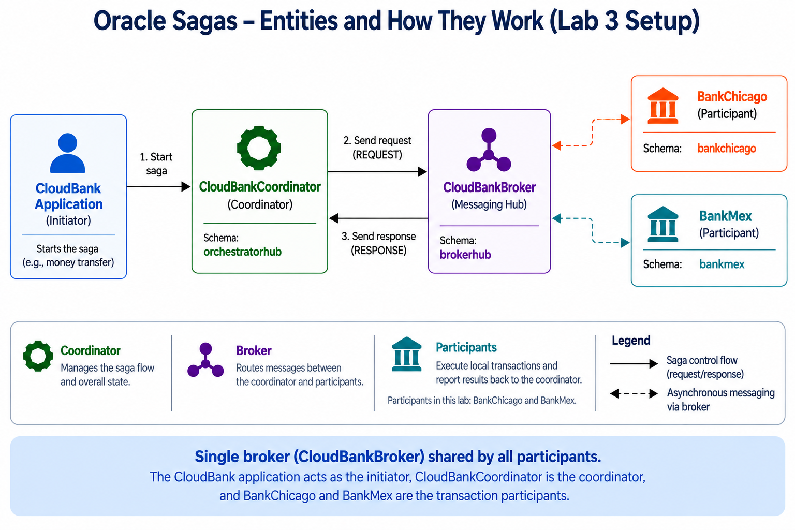
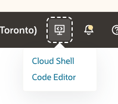

# Core Setup: Sagas Broker, Coordinator & Participants

## **Introduction**

**Oracle Sagas** extend database transaction management with a **long-running transaction pattern**. Instead of relying on a single atomic commit across distributed services, sagas break business logic into multiple steps coordinated by a **Saga Broker** and **Saga Coordinator**, with individual **Saga Participants** executing work and compensating on failure.  

This lab focuses on setting up the **core runtime infrastructure**: the **Broker, Coordinator, and Participants**. You will also explore **roles and permissions**, as well as **monitoring views** provided by the database. These components together allow the Oracle Database to orchestrate complex multi-step workflows in a resilient, auditable, and compensatable fashion.

At their core, sagas address challenges of **distributed transactions** in microservice and multi-tenant environments, where global locks and two-phase commits are impractical. Oracle Sagas provide:
- **Atomicity with compensation** rather than strict rollback.
- **Queue-based coordination** (AQ/TEQ) between services.
- **Built-in administration** with `DBMS_SAGA_ADM`.
- **Observability** through dictionary views of saga state.

<details open>
<summary><mark>Key Characteristics of Oracle Sagas:</mark></summary>

- **Broker:** The message hub that propagates saga events between coordinators and participants.
- **Coordinator:** The central orchestrator that maintains saga state and invokes compensations.
- **Participants:** Business services that implement REQUEST, RESPONSE, COMMIT, ROLLBACK etc handlers.
- **Co-location Constraint:** The saga coordinator and initiator (orchestrator) must reside in the same schema and PDB.
- **Compensation:** When failures occur, the entire saga transaction is rolled back, and the coordinator calls each participant to execute their individual compensating actions to undo their portion of the work.
- **Queues:** Advanced Queuing (AQ) or Transaction Event Queues (TEQ) are used for reliable messaging.
- **Monitoring:** Database views and history tables provide visibility into saga progress.

</details>

In this lab, we will use **SQLcl** to configure the **Broker, Coordinator, and Participants** using the `DBMS_SAGA_ADM` package. These components establish the foundation for Java and PL/SQL saga clients in future labs.

- Estimated time: 15 minutes
<!-- 
Watch the video below for a quick walk-through of the lab.

<!-- [Prepare your environment](videohub:1_nw8ufqzp:medium) -->

[Prepare your environment](videohub::medium)

 -->


<style>
.interactive-command {
  position: relative;
  background: #f5f5f5;
  border: 1px solid #ccc;
  padding: 12px 14px;
  border-radius: 6px;
  margin: 12px 0;
  font-family: 'Courier New', monospace;
  white-space: pre-wrap;
  overflow: visible;
}

.command-text {
  white-space: pre-wrap;
  font-size: 14px;
  line-height: 1.5;
}

.copy-btn {
  position: absolute;
  right: 8px;
  top: 8px;
  background: white;
  border: 1px solid #ccc;
  padding: 3px 8px;
  cursor: pointer;
  font-size: 13px;
  border-radius: 3px;
  transition: background 0.2s, color 0.2s;
  color: black;
  z-index: 2;
}

.copy-btn:hover {
  background: grey;
  color: white;
}

.copy-btn.copied {
  background: #2e7d32;
  color: white;
}
</style>

<script>
function copyToClipboard(elementId, containerId) {
  let text = document.getElementById(elementId).innerText;
  if (navigator.clipboard && navigator.clipboard.writeText) {
    navigator.clipboard.writeText(text);
  } else {
    const textarea = document.createElement('textarea');
    textarea.value = text;
    textarea.setAttribute('readonly', '');
    textarea.style.position = 'fixed';
    textarea.style.left = '-9999px';
    document.body.appendChild(textarea);
    textarea.select();
    document.execCommand('copy');
    document.body.removeChild(textarea);
  }

  let container = document.getElementById(containerId);
  if (container) {
    container.style.opacity = '0.5';
    setTimeout(() => container.style.opacity = '1', 200);
  }
}
</script>

### Objectives

In this lab, you will:

- **Create a Saga Broker** <br />
  Learn how to define and set up the message hub for saga communication.

- **Configure a Saga Coordinator** <br />
  Register the saga orchestrator responsible for maintaining saga state.

- **Register Saga Participants** <br />
  Implement business services that handles REQUEST, RESPONSE, COMMIT AND ROLLBACK etc requests.

- **Assign Roles & Permissions** <br />
  Ensure the correct privileges are available for administrators and applications.

- **Explore Saga Monitoring Views** <br />
  Query system views to inspect saga executions, incomplete sagas, and history.


### Prerequisites

- Oracle **Autonomous Database (ADB-S)** provisioned in Lab 2  
- **CloudShell** access with SQLcl installed  
- User credentials saved from Lab 2 (Brokers, Orchestrators, Bank users)  
- Connected to your ADB instance with appropriate saga roles
- Familiar with basic SQL and PL/SQL concepts  
- Completed Lab 2: Environment Setup

> **Note**: This lab uses the user credentials configured in Lab 2. If you saved user configurations there, they will be auto-populated in the forms below. Otherwise, you can enter them manually and we'll generate the commands for you.

---

## Task 1: Understand the Saga Topology

Before configuring the Saga environment, review the topology used in this lab. The diagram below shows how the Initiator, Coordinator, Broker, and Participants are connected, along with the entity names and schemas used throughout the lab.



In the next task, you will run the Saga Core Setup script to create and register the Broker, Coordinator, and Participants shown above. After the setup is complete, the following tasks provide a closer look at each entity and its role in the Saga workflow.

## Task 2: Setup Saga Entities

### Step 1: Open CloudShell

Click the **CloudShell** tab in your browser.

   > **Note:** If you don’t see any tabs, click **Actions** (to the left of Developer Tools), select **Tabs**, and then choose the **CloudShell** tab.



### Step 2: Run the Saga Core Setup

From Cloud Shell, configure the wallet location and start SQLcl without connecting:

```bash
<copy>
export TNS_ADMIN="$HOME/cloudbank-setup/oracle-saga-cloudbank/adbsSetup/adb_wallet"
sql /nolog
</copy>
```

When the `SQL>` prompt appears, copy and run the complete script below once. Enter the same ADB `ADMIN` password selected in Lab 2; the suggested training password is `Welcome_123#`. The CloudBank schema passwords remain fixed. The script creates the Broker and Coordinator, registers the required Participants, and verifies the resulting configuration.

<pre id="full-setup-script-container" class="interactive-command">
<button class="copy-btn" type="button" onclick="copyToClipboard('full-setup-script', 'full-setup-script-container')">Copy</button>
<span id="full-setup-script" class="command-text">-- =========================================================
-- FULL SAGA CORE SETUP
-- =========================================================
SET VERIFY OFF
SET SERVEROUTPUT ON
ACCEPT ADMIN_PASSWORD CHAR PROMPT 'Enter the ADB ADMIN password (suggested password: Welcome_123#): ' HIDE

DEFINE DATABASE_CONNECTION_TNS_NAME = 'oraclesagademo_medium'
DEFINE BROKER_SCHEMA                = 'brokerhub'
DEFINE BROKER_SCHEMA_PASSWORD       = 'Welcome_123#'
DEFINE ORCHESTRATOR_SCHEMA          = 'orchestratorhub'
DEFINE ORCHESTRATOR_SCHEMA_PASSWORD = 'Welcome_123#'
DEFINE BANKA_SCHEMA                 = 'bankchicago'
DEFINE BANKA_SCHEMA_PASSWORD        = 'Welcome_123#'
DEFINE BANKB_SCHEMA                 = 'bankmex'
DEFINE BANKB_SCHEMA_PASSWORD        = 'Welcome_123#'
DEFINE BROKER_NAME                 = 'CloudBankBroker'
DEFINE COORDINATOR_NAME            = 'CloudBankCoordinator'
DEFINE MAILBOX_SCHEMA              = 'brokerhub'

-- 1. Create the broker
CONNECT &BROKER_SCHEMA/&BROKER_SCHEMA_PASSWORD@'&DATABASE_CONNECTION_TNS_NAME'

BEGIN
  DBMS_SAGA_ADM.ADD_BROKER(
    broker_name   => '&BROKER_NAME',
    broker_schema => '&BROKER_SCHEMA'
  );
END;
/

-- 2. Create the coordinator in the orchestrator schema
CONNECT &ORCHESTRATOR_SCHEMA/&ORCHESTRATOR_SCHEMA_PASSWORD@'&DATABASE_CONNECTION_TNS_NAME'

BEGIN
  DBMS_SAGA_ADM.ADD_COORDINATOR(
    coordinator_name   => '&COORDINATOR_NAME',
    coordinator_schema => '&ORCHESTRATOR_SCHEMA',
    mailbox_schema     => '&MAILBOX_SCHEMA',
    broker_name        => '&BROKER_NAME',
    queue_partitions   => 1,
    listener_count     => DBMS_SAGA_ADM.AQ_NTFN
  );
END;
/

-- 3. Register CloudBank participant
BEGIN
  DBMS_SAGA_ADM.ADD_PARTICIPANT(
    participant_name => 'CloudBank',
    coordinator_name => '&COORDINATOR_NAME',
    mailbox_schema   => '&MAILBOX_SCHEMA',
    broker_name      => '&BROKER_NAME'
  );
END;
/

-- 4. Register BankChicago participant
CONNECT &BANKA_SCHEMA/&BANKA_SCHEMA_PASSWORD@'&DATABASE_CONNECTION_TNS_NAME'

BEGIN
  DBMS_SAGA_ADM.ADD_PARTICIPANT(
    participant_name => 'BankChicago',
    coordinator_name => '&COORDINATOR_NAME',
    mailbox_schema   => '&MAILBOX_SCHEMA',
    broker_name      => '&BROKER_NAME'
  );
END;
/

-- 5. Register BankMex participant
CONNECT &BANKB_SCHEMA/&BANKB_SCHEMA_PASSWORD@'&DATABASE_CONNECTION_TNS_NAME'

BEGIN
  DBMS_SAGA_ADM.ADD_PARTICIPANT(
    participant_name => 'BankMex',
    coordinator_name => '&COORDINATOR_NAME',
    mailbox_schema   => '&MAILBOX_SCHEMA',
    broker_name      => '&BROKER_NAME'
  );
END;
/

-- 6. Verify through USER_SAGA views in each object's owning schema.
-- USER_SAGA views show objects owned by the current schema only.

-- Broker first
CONNECT &BROKER_SCHEMA/&BROKER_SCHEMA_PASSWORD@'&DATABASE_CONNECTION_TNS_NAME'
PROMPT === BrokerHub: broker ===

SELECT name AS broker_name
FROM   user_saga_brokers
WHERE  UPPER(name) = UPPER('&BROKER_NAME');

DECLARE
  entity_count PLS_INTEGER;
BEGIN
  SELECT COUNT(*) INTO entity_count
  FROM user_saga_brokers
  WHERE UPPER(name) = UPPER('&BROKER_NAME');

  IF entity_count != 1 THEN
    RAISE_APPLICATION_ERROR(-20001, 'Saga verification failed: CloudBankBroker is missing.');
  END IF;
END;
/

-- CloudBank participant and coordinator
CONNECT &ORCHESTRATOR_SCHEMA/&ORCHESTRATOR_SCHEMA_PASSWORD@'&DATABASE_CONNECTION_TNS_NAME'
PROMPT === OrchestratorHub: CloudBank and coordinator ===

SELECT name AS participant_name,
       coordinator AS coordinator_name,
       broker_name,
       type
FROM   user_saga_participants
WHERE  UPPER(name) IN ('CLOUDBANK', 'CLOUDBANKCOORDINATOR')
ORDER BY CASE UPPER(name)
           WHEN 'CLOUDBANK' THEN 1
           WHEN 'CLOUDBANKCOORDINATOR' THEN 2
         END;

DECLARE
  entity_count PLS_INTEGER;
BEGIN
  SELECT COUNT(*) INTO entity_count
  FROM user_saga_participants
  WHERE UPPER(name) IN ('CLOUDBANK', 'CLOUDBANKCOORDINATOR')
    AND UPPER(broker_name) = UPPER('&BROKER_NAME');

  IF entity_count != 2 THEN
    RAISE_APPLICATION_ERROR(-20001, 'Saga verification failed: CloudBank participant or coordinator is missing.');
  END IF;
END;
/

-- BankChicago participant
CONNECT &BANKA_SCHEMA/&BANKA_SCHEMA_PASSWORD@'&DATABASE_CONNECTION_TNS_NAME'
PROMPT === BankChicago: participant ===

SELECT name AS participant_name,
       coordinator AS coordinator_name,
       broker_name,
       type
FROM   user_saga_participants
WHERE  UPPER(name) = 'BANKCHICAGO';

DECLARE
  entity_count PLS_INTEGER;
BEGIN
  SELECT COUNT(*) INTO entity_count
  FROM user_saga_participants
  WHERE UPPER(name) = 'BANKCHICAGO'
    AND UPPER(broker_name) = UPPER('&BROKER_NAME');

  IF entity_count != 1 THEN
    RAISE_APPLICATION_ERROR(-20001, 'Saga verification failed: BankChicago is missing.');
  END IF;
END;
/

-- BankMex participant
CONNECT &BANKB_SCHEMA/&BANKB_SCHEMA_PASSWORD@'&DATABASE_CONNECTION_TNS_NAME'
PROMPT === BankMex: participant ===

SELECT name AS participant_name,
       coordinator AS coordinator_name,
       broker_name,
       type
FROM   user_saga_participants
WHERE  UPPER(name) = 'BANKMEX';

DECLARE
  entity_count PLS_INTEGER;
BEGIN
  SELECT COUNT(*) INTO entity_count
  FROM user_saga_participants
  WHERE UPPER(name) = 'BANKMEX'
    AND UPPER(broker_name) = UPPER('&BROKER_NAME');

  IF entity_count != 1 THEN
    RAISE_APPLICATION_ERROR(-20001, 'Saga verification failed: BankMex is missing.');
  END IF;

  DBMS_OUTPUT.PUT_LINE(
    'SUCCESS: Broker, Coordinator, and all configured Saga participants are present.'
  );
END;
/

UNDEFINE ADMIN_PASSWORD</span>
</pre>

> If the broker, coordinator, and participants were already created successfully, do not rerun Steps 1–5. Copy and run only Step 6 to recheck the topology.

**✅ Expected output:**

```text
=== BrokerHub: broker ===

BROKER_NAME
--------------------
CLOUDBANKBROKER

=== OrchestratorHub: CloudBank and coordinator ===

PARTICIPANT_NAME       COORDINATOR_NAME          BROKER_NAME         TYPE
---------------------  ------------------------  -----------------   -----------
CLOUDBANK              CLOUDBANKCOORDINATOR      CLOUDBANKBROKER     Participant
CLOUDBANKCOORDINATOR                            CLOUDBANKBROKER     Coordinator

=== BankChicago: participant ===

PARTICIPANT_NAME       COORDINATOR_NAME          BROKER_NAME         TYPE
---------------------  ------------------------  -----------------   -----------
BANKCHICAGO            CLOUDBANKCOORDINATOR      CLOUDBANKBROKER     Participant

=== BankMex: participant ===

PARTICIPANT_NAME       COORDINATOR_NAME          BROKER_NAME         TYPE
---------------------  ------------------------  -----------------   -----------
BANKMEX                CLOUDBANKCOORDINATOR      CLOUDBANKBROKER     Participant

SUCCESS: Broker, Coordinator, and all configured Saga participants are present.
```

This ordering uses only `USER_SAGA_*` views: the broker is displayed first, followed by the objects owned by OrchestratorHub, BankChicago, and BankMex.

### In one sentence

This setup creates the saga infrastructure that lets the broker route messages, the coordinator manage state, and the participants execute each step of the business workflow.

### Optional learning links

- [Oracle Saga docs](https://docs.oracle.com/en/database/oracle/oracle-database/23/adfns/developing-applications-saga.html)
- [DBMS_SAGA_ADM reference](https://docs.oracle.com/en/database/oracle/oracle-database/26/arpls/dbms_saga_adm.html)

## Task 3: Understand Saga Broker

The broker is the message hub for the saga topology. It provides the communication channel through which the coordinator and participants exchange event-driven requests and responses.

You can see the key code lines in Task 2:

- `EXEC DBMS_SAGA_ADM.ADD_BROKER(...)` — creates the broker.
- `SELECT ... FROM user_saga_brokers` — verifies that the broker exists.

[Syntax and parameter reference for Saga Broker.](https://docs.oracle.com/en/database/oracle/oracle-database/26/arpls/dbms_saga_adm.html#GUID-75EF00AD-BA50-4D12-995B-9475F2846E74)
<br/>

The broker creation and verification logic is already included in the full setup script at the top of this lab. Use that script in CloudShell, then continue with the summary below for the conceptual explanation.

---

## Task 4: Understand Saga Coordinator

The coordinator owns the operation state and decides if the saga succeeds, fails, or rolls back. In Oracle 23ai, the coordinator and initiator must live in the same schema and PDB.

You can see the key code lines in Task 2:

- `EXEC DBMS_SAGA_ADM.ADD_COORDINATOR(...)` — creates the coordinator.
- `SELECT ... FROM user_saga_coordinators` — confirms the coordinator was registered.

> **Important**: The coordinator and orchestrator must be co-located in the same schema and PDB.

[Syntax and parameter reference for Saga Coordinator.](https://docs.oracle.com/en/database/oracle/oracle-database/26/arpls/dbms_saga_adm.html#GUID-E1678F33-E49B-4F4A-BC14-2222D9703A42)
<br/>

The coordinator creation and verification are already included in the single setup script at the top of the lab. Run it from CloudShell and then continue with the summary below.

---

## Task 5: Understand Saga Participants

Each participant represents one business unit in the workflow: `CloudBank`, `BankChicago`, and `BankMex`. They receive requests from the coordinator, execute their local work, and participate in commit or rollback decisions.

You can see the key code lines in Task 2:

- `EXEC DBMS_SAGA_ADM.ADD_PARTICIPANT(...)` — registers each participant.
- `SELECT ... FROM user_saga_participants` — shows the coordinator and registered participants visible to the current user in the CloudBank setup.

[Syntax and parameter reference for Saga Participants.](https://docs.oracle.com/en/database/oracle/oracle-database/26/arpls/dbms_saga_adm.html#ARPLS-GUID-F2E81F25-93AD-4DDB-A887-D325A1F8C84A)
<br/>

The participant registration is already included in the single script at the top of the lab. Run that script in CloudShell and use the summary below to understand the role of each participant.

> **Note**: All participants are registered for Java client implementation, so `CALLBACK_SCHEMA` and `CALLBACK_PACKAGE` remain null in this setup.

---

## Task 6: Roles & Permissions

The saga setup uses the minimum role needed per schema:

- **brokerhub**: `SAGA_ADM_ROLE` + `SAGA_PARTICIPANT_ROLE`
- **orchestratorhub**: `SAGA_ADM_ROLE` + `SAGA_PARTICIPANT_ROLE`
- **bankchicago / bankmex**: `SAGA_PARTICIPANT_ROLE`

This keeps the security model simple and aligned with the demo architecture.

### Step 1: Review the role model

The role assignments are already defined in the setup model and are summarized above. Use the script at the top of the lab as the source of truth, then validate the roles in your environment if you want to confirm the final state.


---

## Task 7: Dictionary Views & Monitoring

Once the setup is complete, you can inspect the registered components and confirm the topology with the Saga dictionary views. This is useful for validation and troubleshooting before running a real saga.

📖 Deep dive: [Oracle docs — Developing Applications with Oracle Database Saga](https://docs.oracle.com/en/database/oracle/oracle-database/23/adfns/developing-applications-saga.html#GUID-3CA20647-5C14-4EDB-9A62-DE0894FA0338)

### Step 1: Review the monitoring model

The final validation step is to inspect the registered participants and the Saga metadata views. The main idea is to confirm that the broker, coordinator, and participant objects are visible and correctly registered before moving to a live saga flow.


---

## Task 8: Optional Information (Not Mandatory)

---

> **Note**: This task is **optional** and not required for completing the lab successfully. It provides advanced configuration options for production deployments and distributed Saga architectures.

This section covers advanced configuration parameters and database link options for production and distributed Saga deployments.

<details>
<summary><strong>📋 i. Saga Configuration Parameters</strong></summary>

Oracle Database 23ai provides comprehensive configuration parameters for fine-tuning Saga behavior, performance, and monitoring. These parameters control timeout settings, queue management, retry logic, and historical data retention.

#### Complete Parameter Reference:

| Parameter | Default | ADB-S Modifiable | Local DB Modifiable | Description |
|-----------|---------|------------------|---------------------|-------------|
| `max_saga_duration` | 86400 seconds | NO | YES | Maximum time a saga can remain active before automatic timeout |
| `_use_saga_qtyp` | 0 (Classic AQ) | NO | YES | Queue type: 0=Classic AQ queues, 1=Transactional Event Queues (TEQ) |
| `saga_hist_retention` | 30 days | NO | YES | Retention period for completed saga transaction history |
| `_saga_afterlra_interval` | 300 seconds | NO | YES | Interval for AfterLRA method invocation after saga completion |

#### How to Check Current Values:

**For ADB-S (Autonomous Database Serverless):**
```sql
-- Template command (no copy/execute needed)
SELECT name, value, description FROM V$PARAMETER 
WHERE name IN ('max_saga_duration', '_use_saga_qtyp', 'saga_hist_retention', '_saga_afterlra_interval')
ORDER BY name;
```

**For Local Oracle Database:**
```sql  
-- Template command (no copy/execute needed)
ALTER SYSTEM SET max_saga_duration = 172800;  -- 48 hours
ALTER SYSTEM SET saga_hist_retention = 60;    -- 60 days
ALTER SYSTEM SET _use_saga_qtyp = 1;          -- Enable TEQ
ALTER SYSTEM SET _saga_afterlra_interval = 600; -- 10 minutes
```

**Configuration Impact:**
- **ADB-S Environment**: All parameters are managed by Oracle Cloud
- **Local DB Deployment**: Full administrative control over all saga parameters for production optimization
- **Performance Tuning**: Higher queue partitions and TEQ enable better concurrency but require careful coordination
</details>

<details>
<summary><strong>📋 ii. Database Links for Distributed Sagas</strong></summary>

Oracle Database 23ai Saga framework supports distributed saga transactions across multiple databases through database links. This enables saga participants to reside in different Oracle databases while maintaining ACID properties and saga transaction integrity. The `SAGA_CONNECT_ROLE` provides the necessary privileges for cross-database saga operations.

#### `SAGA_CONNECT_ROLE` Privileges and Purpose:

The `SAGA_CONNECT_ROLE` is a predefined database role that grants essential privileges for distributed saga operations:

- **Remote Table Access**: `SELECT`, `INSERT`, `UPDATE`, `DELETE` privileges on remote saga tables
- **Queue Operations**: Access to Advanced Queuing infrastructure across database boundaries  
- **Saga Metadata**: Read/write access to distributed saga coordination metadata
- **Network Connectivity**: `CONNECT` and `RESOURCE` roles for remote database authentication

#### Role Assignment for Distributed Scenarios:
```sql
-- Template commands (no copy/execute needed)
-- Grant SAGA_CONNECT_ROLE to schemas that need cross-database access
GRANT SAGA_CONNECT_ROLE TO participant_schema;
GRANT SAGA_CONNECT_ROLE TO coordinator_schema;

-- Verify role assignments
SELECT grantee, granted_role FROM DBA_ROLE_PRIVS 
WHERE granted_role = 'SAGA_CONNECT_ROLE';
```

#### Why Database Links are Required - Message Propagation:

Database links are essential for **message propagation** in distributed saga topologies. Message propagation between different pluggable databases (PDBs) requires specific database links to transfer saga messages:

- **Participant to Broker Propagation**: To propagate a participant's outbound topic to a broker's INOUT topic, the message propagation job uses the database link from the `dblink_to_broker` parameter
- **Broker to Participant Propagation**: To propagate a broker's INOUT topic to a participant's inbound topic, the message propagation job uses the database link from the `dblink_to_participant` parameter

Without these database links, participants in different database instances cannot exchange the messages required for coordinating saga transactions. The links create the communication channels that enable distributed saga coordination across multiple Oracle database instances.

#### Database Link Implementation Approaches:

For multi-database Saga deployments, two approaches are available depending on your environment:

<details close>
<summary><strong>📋 Traditional Database Links (Local/On-Premises)</strong></summary>

**For Local Oracle Database deployments:**

```sql
<copy>
-- Create traditional database link
CREATE DATABASE LINK remote_saga_db
CONNECT TO remote_user IDENTIFIED BY remote_password
USING '(DESCRIPTION=
  (ADDRESS=(PROTOCOL=TCP)(HOST=remote_host)(PORT=1521))
  (CONNECT_DATA=(SERVICE_NAME=remote_service))
)';

-- Test the database link
SELECT * FROM dual@remote_saga_db;
</copy>
```

**Parameters:**
- **`CONNECT TO`**: Remote database username
- **`IDENTIFIED BY`**: Remote database password  
- **`USING`**: TNS connection descriptor
- **`HOST`**: Remote database hostname/IP
- **`PORT`**: Database listener port (typically 1521)
- **`SERVICE_NAME`**: Target database service name
</details>

<details close>
<summary><strong>📋 DBMS_CLOUD Database Links (ADB-S Environment)</strong></summary>

**For Autonomous Database Serverless deployments:**

```sql
<copy>
-- Step 1: Create credentials for remote ADB
BEGIN
  DBMS_CLOUD.CREATE_CREDENTIAL(
    credential_name => 'REMOTE_ADB_CRED',
    username => 'REMOTE_USER',
    password => 'remote_password'
  );
END;
/

-- Step 2: Create database link using DBMS_CLOUD
BEGIN
  DBMS_CLOUD_ADMIN.CREATE_DATABASE_LINK(
    db_link_name => 'REMOTE_SAGA_LINK',
    hostname => 'adb.region.oraclecloud.com',
    port => '1521',
    service_name => 'remote_adb_service.adb.region.oraclecloud.com',
    credential_name => 'REMOTE_ADB_CRED',
    directory_name => NULL  -- For TLS without wallet
  );
END;
/

-- Test the DBMS_CLOUD database link
SELECT * FROM dual@REMOTE_SAGA_LINK;
</copy>
```

**Parameters:**
- **`credential_name`**: Name for stored remote credentials
- **`hostname`**: Remote ADB hostname from connection string
- **`service_name`**: Complete service name including domain
- **`directory_name`**: NULL for TLS, directory name for mTLS with wallet
</details>
<br/>

#### Usage Guidelines and Best Practices:

- **Traditional DB Links**: Use for local Oracle Database and on-premises deployments
- **DBMS_CLOUD Links**: Required for Autonomous Database Serverless connections  
- **Cross-PDB Sagas**: Enable participants across different databases while maintaining ACID properties
- **Security**: Database links inherit the connecting user's privileges; use dedicated saga service accounts
- **Performance**: Network latency affects distributed saga performance; consider participant placement strategies
- **Failover**: Configure connection pooling and retry logic for distributed saga resilience
</details>

<details>
<summary><strong>📋 iii. Other `DBMS_SAGA_ADM` Management Commands</strong></summary>

The `DBMS_SAGA_ADM` package provides additional administrative procedures for managing saga infrastructure beyond the creation commands covered in this lab. These commands are essential for production environments where saga components need to be modified, removed, or reconfigured.

#### Removal and Cleanup Commands:

**DROP_BROKER Procedure:**
- **Purpose**: Drops a broker and the associated JMS topic from the saga framework
- **Usage**: Use when decommissioning a broker or during environment cleanup

```sql
-- Template command (no copy/execute needed)
EXEC DBMS_SAGA_ADM.DROP_BROKER(
  broker_name => '&lt;BROKER_NAME&gt;'
);
```

**DROP_COORDINATOR Procedure:**
- **Purpose**: Drops the given coordinator and disables message propagation
- **Usage**: Use when removing a coordinator configuration or during topology changes

```sql
-- Template command (no copy/execute needed)
EXEC DBMS_SAGA_ADM.DROP_COORDINATOR(
  coordinator_name => '&lt;COORDINATOR_NAME&gt;'
);
```

**DROP_PARTICIPANT Procedure:**
- **Purpose**: Drops the given participant on the local PDB and the broker
- **Usage**: Use when removing a participant from the saga topology

```sql
-- Template command (no copy/execute needed)
EXEC DBMS_SAGA_ADM.DROP_PARTICIPANT(
  participant_name => '&lt;PARTICIPANT_NAME&gt;',
  broker_name => '&lt;BROKER_NAME&gt;'
);
```

#### Callback Management Command:

**REGISTER_SAGA_CALLBACK Procedure:**
- **Purpose**: Enables users to create or modify a callback package for saga participants
- **Usage**: Use to register or update PL/SQL callback packages for database-native saga participants

```sql
-- Template command (no copy/execute needed)
EXEC DBMS_SAGA_ADM.REGISTER_SAGA_CALLBACK(
  participant_name => '&lt;PARTICIPANT_NAME&gt;',
  callback_schema => '&lt;CALLBACK_SCHEMA&gt;',
  callback_package => '&lt;CALLBACK_PACKAGE&gt;'
);
```

#### Administrative Notes:

- **Dependency Order**: Always drop participants before dropping coordinators, and drop coordinators before dropping brokers
- **Data Preservation**: Dropping saga components does not automatically clean up historical saga transaction data
- **Distributed Cleanup**: In distributed topologies, cleanup commands must be executed on each relevant database instance
- **Production Safety**: Use these commands with caution in production environments as they permanently remove saga infrastructure

</details>

<details>
<summary><strong>📋 iv. PL/SQL Callbacks for Database-Native Saga Participants</strong></summary>

Oracle Database 23ai enables saga participants to be implemented as database-native PL/SQL packages through specialized callback packages. These callback packages provide a structured way to define custom business logic for different stages of saga transaction processing while abstracting away the underlying saga infrastructure complexity.

#### Callback Package Architecture:

PL/SQL callback packages serve as the integration layer between the saga framework and your business logic, allowing developers to focus on implementing specific business operations rather than managing saga coordination details. The callback package receives saga events and executes corresponding business logic while the framework handles message routing, transaction coordination, and error management.

#### Required Callback Procedures:

Each callback package can implement several optional procedures to handle different saga transaction stages:

**Request Handler:**
```sql
-- Template procedure (no copy/execute needed)
FUNCTION request(
  saga_id     IN RAW,
  saga_sender IN VARCHAR2,
  payload     IN JSON DEFAULT NULL
) RETURN JSON;
```
- **Purpose**: Processes incoming saga messages with `REQUEST` opcode
- **Returns**: JSON payload response to the saga coordinator
- **Usage**: Implement primary business logic for the participant's operation

**Response Handler:**
```sql
-- Template procedure (no copy/execute needed)
PROCEDURE response(
  saga_id     IN RAW,
  saga_sender IN VARCHAR2,
  payload     IN JSON DEFAULT NULL
);
```
- **Purpose**: Processes saga messages with `RESPONSE` opcode
- **Usage**: Handle responses from other saga participants

**Commit Lifecycle Handlers:**
```sql
-- Template procedures (no copy/execute needed)
PROCEDURE before_commit(
  saga_id     IN RAW,
  saga_sender IN VARCHAR2,
  payload     IN JSON DEFAULT NULL
);

PROCEDURE after_commit(
  saga_id     IN RAW,
  saga_sender IN VARCHAR2,
  payload     IN JSON DEFAULT NULL
);
```
- **Purpose**: Execute logic before and after saga commit operations
- **Usage**: Implement finalization or cleanup logic for successful transactions

**Rollback Lifecycle Handlers:**
```sql
-- Template procedures (no copy/execute needed)
PROCEDURE before_rollback(
  saga_id     IN RAW,
  saga_sender IN VARCHAR2,
  payload     IN JSON DEFAULT NULL
);

PROCEDURE after_rollback(
  saga_id     IN RAW,
  saga_sender IN VARCHAR2,
  payload     IN JSON DEFAULT NULL
);
```
- **Purpose**: Execute compensating actions during saga rollback
- **Usage**: Implement compensation logic to undo participant-specific operations

#### Implementation Guidelines:

- **Transaction Control**: Callback procedures cannot invoke explicit `COMMIT` or `ROLLBACK` operations
- **Error Handling**: Use proper exception handling to ensure saga framework receives appropriate error signals
- **JSON Payloads**: Leverage JSON for structured data exchange between saga participants
- **Stateless Design**: Design callback procedures to be stateless and idempotent where possible
- **Business Logic Focus**: Keep callback procedures focused on business logic rather than saga infrastructure concerns

#### Integration with `REGISTER_SAGA_CALLBACK`:

After creating your callback package, register it with the saga participant using the `REGISTER_SAGA_CALLBACK` procedure shown in the previous section. This links your business logic implementation to the saga framework's message processing pipeline.

PL/SQL callbacks provide a powerful way to implement database-native saga participants while maintaining clean separation between business logic and saga coordination infrastructure.
</details>

---

## Summary

✅ **Congratulations!** You have successfully completed Lab 3: Core Setup. You have:

- ✅ **Created a Saga Broker** (`brokerhub`) for message coordination
- ✅ **Configured a Saga Coordinator** (`orchestratorhub`) for saga orchestration
- ✅ **Registered Saga Participants** (`CloudBank`, `BankChicago`, and `BankMex`) for Java client implementation
- ✅ **Verified roles and permissions** for saga framework access
- ✅ **Explored monitoring views** and infrastructure components
- ✅ **Learned advanced configuration options** for production deployments

Your Oracle Sagas foundation is now ready for implementing actual business logic!

**Next Steps:** In **Lab 4: Developing with PL/SQL**, you'll implement the money transfer saga logic in your callback packages and execute your first saga transactions.

---

## Learn More

- [Oracle Database 23ai: Developing Applications with Saga](https://docs.oracle.com/en/database/oracle/oracle-database/23/adfns/developing-applications-saga.html)  
- [DBMS_SAGA_ADM Documentation](https://docs.oracle.com/en/database/oracle/oracle-database/23/arpls/dbms_saga_adm.html)  

## Acknowledgements

* **Contributors** — Vinay Pandhariwal, Amit Ketkar, Pavas Navaney, Luis Cruz, Sebastian Gerritsen
* **Created By/Date** — Vinay Pandhariwal, August 2025  
* **Last Updated By/Date** — Vinay Pandhariwal, August 2025
